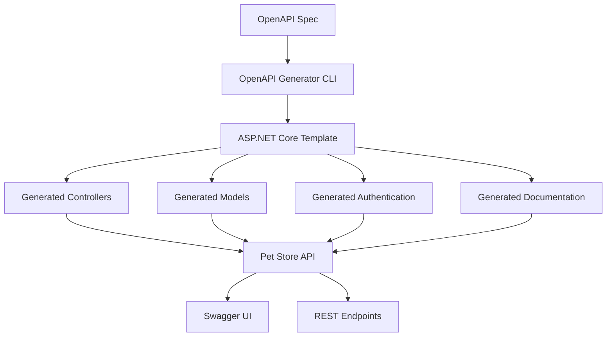

# Coding Agent POC - Pet Store API

This repository contains a .NET Web API generated from the Swagger Petstore OpenAPI 3.0 specification.

## Overview

The Pet Store API is a complete ASP.NET Core 8.0 Web API implementation that provides:

- **Pet Management**: CRUD operations for pets including status filtering and image uploads
- **Store Management**: Order processing and inventory management
- **User Management**: User registration, authentication, and profile management

## Generated from OpenAPI Specification

This API was generated using the OpenAPI Generator tool from the official Swagger Petstore specification:
- **Source**: https://github.com/swagger-api/swagger-petstore/blob/master/src/main/resources/openapi.yaml
- **Generator**: OpenAPI Generator (aspnetcore template)
- **Framework**: ASP.NET Core 8.0

## Project Structure

```
├── openapi.yaml                    # Original OpenAPI specification
├── PetStoreApi/                    # Generated .NET API project
│   ├── src/PetStore.Api/           # Main API source code
│   │   ├── Controllers/            # API controllers (PetApi, StoreApi, UserApi)
│   │   ├── Models/                 # Data models (Pet, Order, User, etc.)
│   │   ├── Authentication/         # Authentication components
│   │   ├── Filters/                # Request/Response filters
│   │   └── Program.cs              # Application entry point
│   ├── PetStore.Api.sln           # Solution file
│   └── README.md                   # Detailed API documentation
└── README.md                       # This file
```

## Quick Start

### Prerequisites

- .NET 8.0 SDK
- Docker (optional, for containerized deployment)

### Running the API

1. **Navigate to the API directory:**
   ```bash
   cd PetStoreApi/src/PetStore.Api
   ```

2. **Restore dependencies and build:**
   ```bash
   dotnet restore
   dotnet build
   ```

3. **Run the application:**
   ```bash
   dotnet run
   ```

4. **Access the API:**
   - API Base URL: `http://localhost:5000`
   - Swagger UI: `http://localhost:5000/openapi/`
   - OpenAPI JSON: `http://localhost:5000/openapi/1.0.27-SNAPSHOT/openapi.json`

### Using Docker

```bash
cd PetStoreApi/src/PetStore.Api
docker build -t petstore-api .
docker run -p 5000:8080 petstore-api
```

## API Endpoints

The generated API includes the following endpoint groups:

### Pet Management
- `POST /api/v3/pet` - Add a new pet
- `PUT /api/v3/pet` - Update an existing pet
- `GET /api/v3/pet/findByStatus` - Find pets by status
- `GET /api/v3/pet/findByTags` - Find pets by tags
- `GET /api/v3/pet/{petId}` - Get pet by ID
- `POST /api/v3/pet/{petId}` - Update pet with form data
- `DELETE /api/v3/pet/{petId}` - Delete a pet
- `POST /api/v3/pet/{petId}/uploadImage` - Upload pet image

### Store Management
- `GET /api/v3/store/inventory` - Get inventory
- `POST /api/v3/store/order` - Place an order
- `GET /api/v3/store/order/{orderId}` - Get order by ID
- `DELETE /api/v3/store/order/{orderId}` - Delete order

### User Management
- `POST /api/v3/user` - Create user
- `POST /api/v3/user/createWithList` - Create users with array
- `GET /api/v3/user/login` - User login
- `GET /api/v3/user/logout` - User logout
- `GET /api/v3/user/{username}` - Get user by username
- `PUT /api/v3/user/{username}` - Update user
- `DELETE /api/v3/user/{username}` - Delete user

## Development

The generated code includes:

- **Model Classes**: Complete data models with validation attributes
- **Controller Stubs**: Endpoint implementations ready for business logic
- **Swagger Integration**: Built-in OpenAPI documentation
- **Authentication Framework**: Basic authentication setup
- **Docker Support**: Ready-to-deploy containerization

## Code Generation Logic Flow



## Contributing

1. The API controllers contain TODO comments where business logic should be implemented
2. Models are complete and include proper validation attributes
3. Authentication can be customized in the `Authentication/` folder
4. Additional filters and middleware can be added as needed

## License

This project follows the same license as the original Swagger Petstore specification.