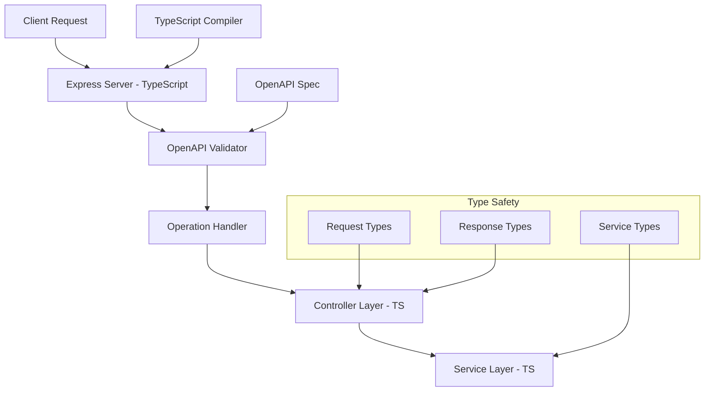

# Swagger Petstore - TypeScript Express Server

A complete TypeScript Express.js API server generated from the Swagger Petstore OpenAPI 3.0 specification.

## 🚀 Features

- **Full TypeScript Implementation**: Type-safe API development with comprehensive typing
- **OpenAPI 3.0 Validation**: Automatic request/response validation using express-openapi-validator
- **Interactive Documentation**: Swagger UI available at `/api-docs`
- **Modern Express.js**: Latest Express.js with TypeScript types
- **Structured Architecture**: Clean separation of controllers, services, and types
- **Mock Data**: Ready-to-use mock implementations for all endpoints
- **Type Safety**: Compile-time error checking and enhanced IDE support

## 📋 API Endpoints

### Pet Management
- `POST /pet` - Add a new pet to the store
- `PUT /pet` - Update an existing pet
- `GET /pet/findByStatus` - Find pets by status
- `GET /pet/findByTags` - Find pets by tags
- `GET /pet/{petId}` - Find pet by ID
- `POST /pet/{petId}` - Update a pet with form data
- `DELETE /pet/{petId}` - Delete a pet
- `POST /pet/{petId}/uploadImage` - Upload an image

### Store Operations
- `GET /store/inventory` - Returns pet inventories by status
- `POST /store/order` - Place an order for a pet
- `GET /store/order/{orderId}` - Find purchase order by ID
- `DELETE /store/order/{orderId}` - Delete purchase order by ID

### User Management
- `POST /user` - Create user
- `POST /user/createWithList` - Create list of users with given input array
- `GET /user/login` - Log user into the system
- `GET /user/logout` - Log out current logged in user session
- `GET /user/{username}` - Get user by username
- `PUT /user/{username}` - Update user
- `DELETE /user/{username}` - Delete user

## 📁 Project Structure

```
src/
├── controllers/          # TypeScript request handlers
│   ├── Controller.ts     # Base controller with common functionality
│   ├── PetController.ts  # Pet-related endpoints
│   ├── StoreController.ts # Store-related endpoints
│   ├── UserController.ts # User-related endpoints
│   └── *.ts             # Individual operation handlers
├── services/             # TypeScript business logic layer
│   ├── Service.ts       # Base service class
│   ├── PetService.ts    # Pet business logic with types
│   ├── StoreService.ts  # Store business logic with types
│   └── UserService.ts   # User business logic with types
├── types/               # TypeScript type definitions
│   └── index.ts         # Shared interfaces and types
├── config.ts            # Configuration with type safety
├── logger.ts            # Winston logging configuration
├── expressServer.ts     # Express server setup
└── index.ts             # Application entry point
```

## 🛠️ Installation & Setup

### Prerequisites
- Node.js >= 16.0.0
- npm >= 7.0.0
- TypeScript knowledge (recommended)

### Quick Start

1. **Install dependencies:**
   ```bash
   npm install
   ```

2. **Build TypeScript:**
   ```bash
   npm run build
   ```

3. **Start the server:**
   ```bash
   npm start
   ```

4. **Development mode (with auto-reload):**
   ```bash
   npm run dev
   ```

5. **Access the API:**
   - API Documentation: http://localhost:8080/api-docs/
   - OpenAPI Spec: http://localhost:8080/openapi
   - Health Check: http://localhost:8080/hello

## 🔧 TypeScript Configuration

The project uses modern TypeScript configuration with strict type checking:

```typescript
// tsconfig.json highlights
{
  "compilerOptions": {
    "target": "ES2020",
    "module": "commonjs",
    "strict": true,
    "esModuleInterop": true,
    "declaration": true,
    "sourceMap": true
  }
}
```

## 🧪 Testing & Usage

### Sample API Calls

```bash
# Health check
curl http://localhost:8080/hello

# Get pets by status
curl "http://localhost:8080/pet/findByStatus?status=available"

# Get store inventory (requires api_key header)
curl -H "api_key: test" "http://localhost:8080/store/inventory"

# Get pet by ID
curl "http://localhost:8080/pet/1"

# Create a new pet
curl -X POST "http://localhost:8080/pet" \
  -H "Content-Type: application/json" \
  -d '{
    "name": "Buddy",
    "photoUrls": ["https://example.com/photo.jpg"],
    "status": "available"
  }'

# User login
curl "http://localhost:8080/user/login?username=test&password=test"
```

## 💡 TypeScript Benefits

1. **Type Safety**: All request/response objects are strongly typed
2. **Better IDE Support**: Enhanced autocomplete, refactoring, and error detection
3. **Compile-time Validation**: Catch errors before runtime
4. **Self-documenting Code**: Types serve as inline documentation
5. **Easier Refactoring**: Safe code changes with compile-time verification
6. **Enhanced Developer Experience**: Better debugging and development tools

## 🔐 Security & Validation

- **Request Validation**: Automatic validation against OpenAPI schema
- **Type Safety**: TypeScript prevents type-related runtime errors
- **Error Handling**: Comprehensive error responses with proper status codes
- **Input Sanitization**: Built-in protection against malformed requests

## 🚦 Development

### Adding New Features

1. **Update OpenAPI Spec**: Modify `openapi.yaml` for new endpoints
2. **Update Types**: Add new interfaces in `src/types/index.ts`
3. **Add Service Logic**: Implement business logic in appropriate service files
4. **Add Controllers**: Create controller methods for new endpoints
5. **Create Operation Handlers**: Add individual handler files for new operations
6. **Build & Test**: Run `npm run build` and test the endpoints

### Available Scripts

- `npm run build` - Compile TypeScript to JavaScript
- `npm start` - Build and start the production server
- `npm run dev` - Start development server with auto-reload
- `npm run prestart` - Install dependencies (runs automatically)

### TypeScript Development Workflow

```bash
# Watch mode for continuous compilation
npx tsc --watch

# Development with auto-reload
npm run dev

# Type checking only
npx tsc --noEmit

# Build for production
npm run build
```

## 📚 API Documentation

- **Interactive Swagger UI**: http://localhost:8080/api-docs/
- **OpenAPI Specification**: http://localhost:8080/openapi
- **TypeScript Types**: Generated from OpenAPI schema with full type safety

## 🏗️ Architecture



## 🤝 Generated from OpenAPI

This TypeScript server was generated and converted from the official Swagger Petstore specification:
- **Source**: https://github.com/swagger-api/swagger-petstore
- **Generator**: nodejs-express-server (converted to TypeScript)
- **OpenAPI Version**: 3.0.4
- **Language**: TypeScript with full type safety

The implementation follows OpenAPI best practices and TypeScript conventions, ready for production use with custom business logic implementation.
